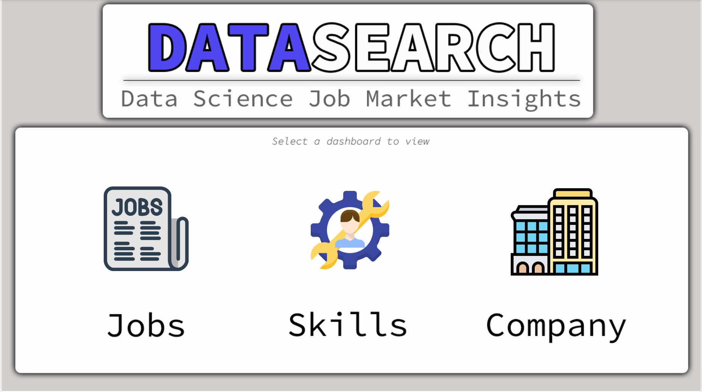
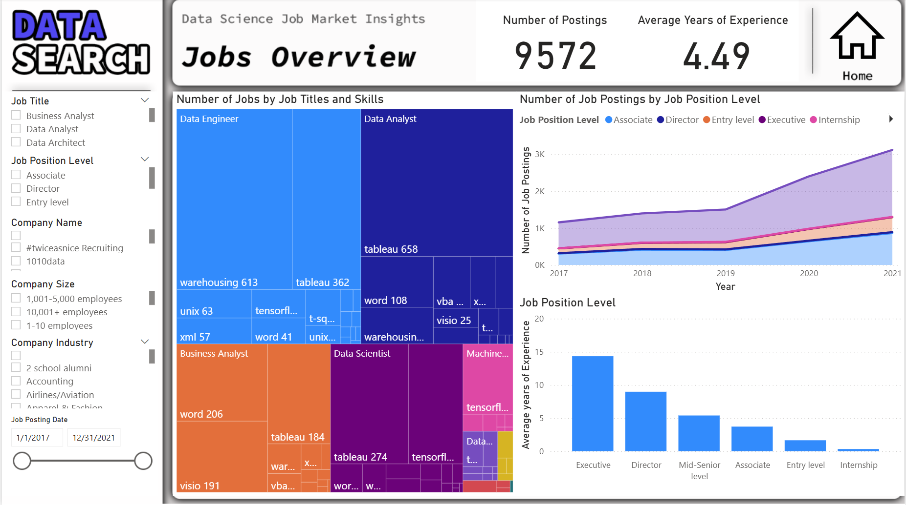
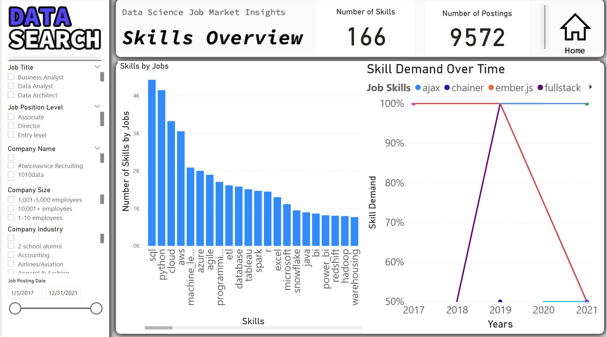
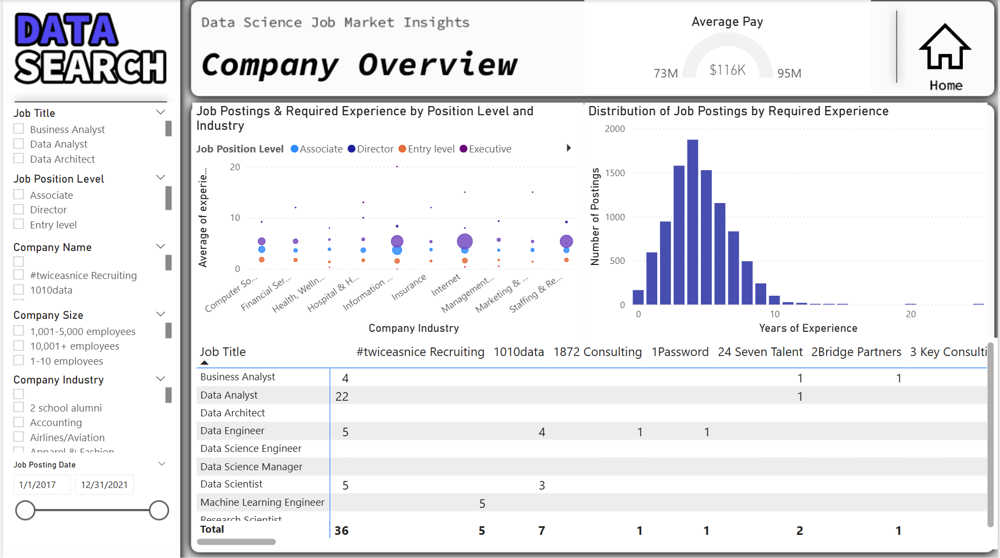

# powerbi-job-market-analysis
This project analyzes job market data to identify trends in job demand, required skills, experience levels, and company hiring patterns using Power BI.  The goal is to provide insights for job seekers, career changers, and data professionals to better understand the current job market.

# 1) Objectives
- Identify the most in-demand job roles
- Analyze required years of experience
- Explore top skills across job postings
- Understand hiring trends by industry and company
- Compare job opportunities by level (entry, mid, senior)

# 2) Tools Used
- Power BI (data modeling & visualization)
- Power Query (data cleaning)
- DAX (basic measures)
- Excel / CSV dataset

# 3) Dataset
The dataset contains job postings with:
- Job title
- Company
- Industry
- Required skills
- Years of experience
- Posting count
(Source: DataCamp project dataset)

# 4) Dashboard Features

a) Home Page
- Key KPIs (total jobs, average experience, etc.)
- Navigation buttons

b) Jobs Analysis
- Job postings by role
- Experience required by position level
- Trends in job demand

c)  Skills Analysis
- Most in-demand skills
- Skill likelihood matrix
- Skills vs job roles

d) Company & Industry Analysis
- Job postings by company
- Industry hiring trends
- Experience vs industry

# 5) Key Insights
- Mid-level roles dominate the job market
- Certain skills (e.g., SQL, Python) appear across multiple roles
- Higher experience levels are linked to specific industries
- Some companies have significantly higher posting activity

# 6) Dashboard Preview

